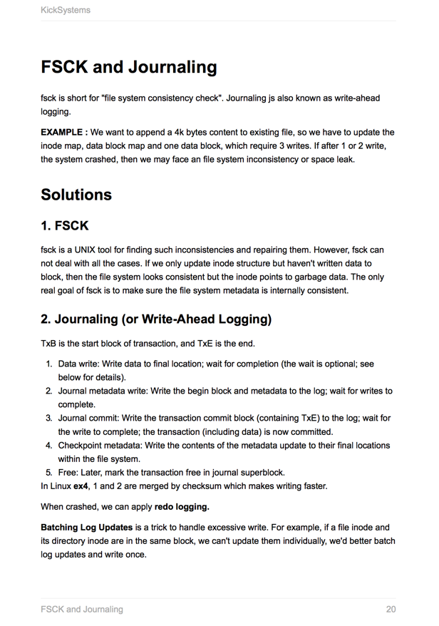

KickSystems**V1.1** aims to help you kick Systems.
=======

[Downloads](https://www.gitbook.com/download/pdf/book/gzc/kicksystems)

####Sample Page

We will cover

1. [Binary Representation](./binary_representation.md)
2. [Linking](./linking.md)
3. [Exception](./exception.md)
4. [I/O](./io.md)
5. [Process](./process.md)
6. [Thread](./thread.md)
7. [Concurrency](./concurrency.md)
8. [Virtual Memory](virtual_memory.md)
9. [FSCK and Journaling](./fsck_and_journaling.md)
10. [System Design](./system_design.md)
11. [System Admin](./system_admin.md)
12. [C++](./c++.md)
13. [Trick](./trick.md)

***
Follow [louis1992](https://github.com/gzc) for more resources.