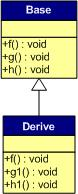

# C++

##1. Vtable

讨论C++多态 virtual table的mempry layout

    #include<iostream>
    #include<stack>
    using namespace std;

    class Base {
    public:
        virtual void f() { cout << "Base::f" << endl; }
        virtual void g() { cout << "Base::g" << endl; }
        virtual void h() { cout << "Base::h" << endl; }
    };

    int main()
    {
        typedef void(*Fun)(void);
    
	    static int global = 1;
        Base b1;
        Base b2;
    

	    cout << "global variable address : " << &global << endl; 
        cout << "虚函数表地址：" << (int*)*(int*)(&b1) << endl;
        cout << "虚函数表地址：" << (int*)*(int*)(&b2) << endl;
    
        cout << "虚函数表 — 第一个函数地址：" << (int*)*(int*)(&b1) << endl;
        cout << "虚函数表 — 第一个函数地址：" << (int*)*(int*)(&b2) << endl;
    
        // Invoke the first virtual function
        Fun pFun1 = (Fun)(*(int*)(*(int*)(&b1)));
	    Fun pFun2 = (Fun)(*(int*)((*(int*)&b1)+8));
	    Fun pFun3 = (Fun)(*(int*)((*(int*)&b1)+16));
        pFun1();
	    pFun2();
	    pFun3();

        return 0;
    }
    
**output:**

    global variable address : 0x602070
    虚函数表地址：0x400cb0
    虚函数表地址：0x400cb0
    虚函数表 — 第一个函数地址：0x400cb0
    虚函数表 — 第一个函数地址：0x400cb0
    Base::f
    Base::g
    Base::h

首先,vtable的pointer存在对象的首地址.所以我们先取得对象首地址，变成int*再derefernece就可以取得vtable的address. 之后，函数指针就按顺序放在table entry我们可以顺序访问.我的是64bit的所以每次+8.

根据地址可以看出,虚函数是在.text段,vtable是在.data段.如果你运行在32bit的系统就会很清晰看到static变量就分配在vtable附近.

另外我不太熟悉Xcode的内存保护,这个代码无法在Xcode上跑，所以我是在ubuntu下测试的.

接下来的内容参考自[这里](http://blog.csdn.net/haoel/article/details/1948051)

**一般继承（无虚函数覆盖）**

 

* 虚函数按照其声明顺序放于表中
* 父类的虚函数在子类的虚函数前面。

**一般继承（有虚函数覆盖）**

* 覆盖的f()函数被放到了虚表中原来父类虚函数的位置。
* 没有被覆盖的函数依旧。

**多重继承（无虚函数覆盖）**

 

* 每个父类都有自己的虚表。
* 子类的成员函数被放到了第一个父类的表中。（所谓的第一个父类是按照声明顺序来判断的）

这样做就是为了解决不同的父类类型的指针指向同一个子类实例，而能够调用到实际的函数。

**多重继承（有虚函数覆盖）**

